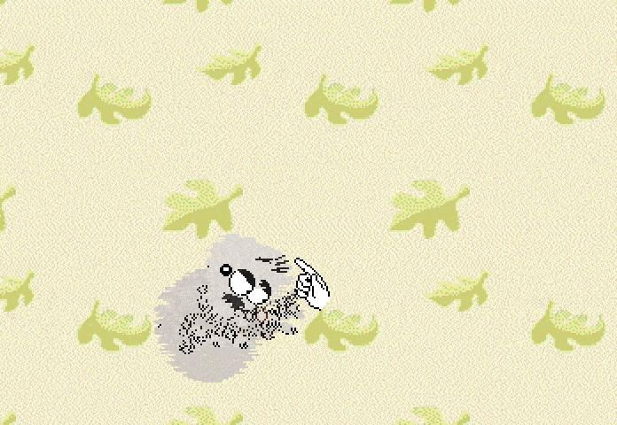

# Spiderz

Cute little jumping spiderz for Petz 4. Loosely based on the popular cartoon "Lucas The Spider".

This repository contains lnz files for creating custom Spiderz. These lnz bases provide a way to release Spiderz without a breedfile. You are welcome to create your own breedfile, but keep in mind that Spiderz do not breed true due to their scales and paintball-based eyes.

To use these files you'll need basic familiarity with hexing terminology and tooling. If you're not familiar with hexing, feel free to download a pre-made Spiderz on my site.

## How to use

To create your own spiderz, I recommend using the `spider-blank.lnz` template. Paste the lnz into a the adult lnz of a cat breedfile of your choice and you'll be able to edit it in Petz Workshop.

Once you've finished your design, you can adopt a cat from the breedfile or use the lnz in the breedfile to brex a cat.

I recommend using an orange shorthair. If you use another breed, you'll need to change the [Sounds] section. I also recommend pasting the spiderz lnz into the child lnz as well but changing the scales to 30/30.

## Advanced spider-making

The raw breedfile lnz for creating breeds/OWs rather than brexing is also available as `raw-spider.lnz`, which has useful comments for editing in Lnz Pro. Do not use this for brexing as it will cause errors. Pull requests are welcome! Especially to fix the known bugs.

## Known Bugs

- Color areas are not correctly defined so painting with paint brush will not look right
- Need to clean up textures, there are a couple unused ones

## Credits

- hexed off of the ant breed by gyiyg https://gyiyg.neocities.org/
- extra eye inspiration from bad_death https://baddeath.neocities.org
- eye detailing from pikaglitch https://pikaglitch.neocities.org/eyeballz.html
